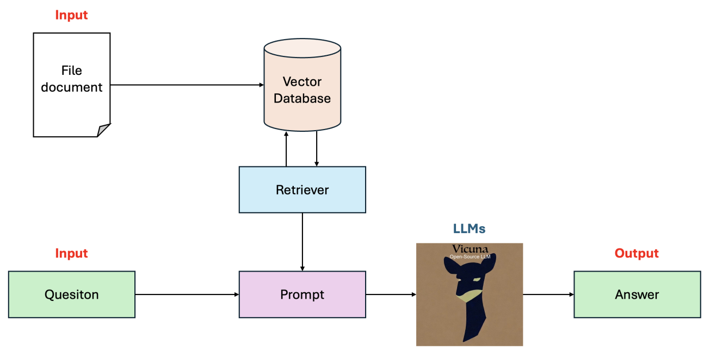

# Chatbot with Retrieval-Augmented Generation (RAG)

## Overview
This repository contains a chatbot application that leverages Retrieval-Augmented Generation (RAG) to answer questions based on the content of a provided PDF file. The chatbot uses the Vicuna Vicious-7B-v1.5 model with quantization, and the Langchain pipeline for processing. The frontend is built using Chainlit.
    

## Features
 - *PDF Processing*: Upload a PDF file which is then transformed into a vector database using Chroma.
 - *Question Answering*: Ask relevant questions based on the content of the PDF, and receive accurate answers.
 - *Efficient Model*: Utilizes the Vicuna Vicious-7B-v1.5 model with quantization for efficient performance.
 - *User-Friendly Interface*: Built with Chainlit for an intuitive and interactive user experience.

## Getting started
All implementation details are given in the file `Chatbot_with_RAG.ipynb`.

## Acknowledgements
- Vicuna Vicious-7B-v1.5 for the language model.
- Chroma for the vector database.
- Langchain for the pipeline.
- Chainlit for the frontend framework for Conversational AI.